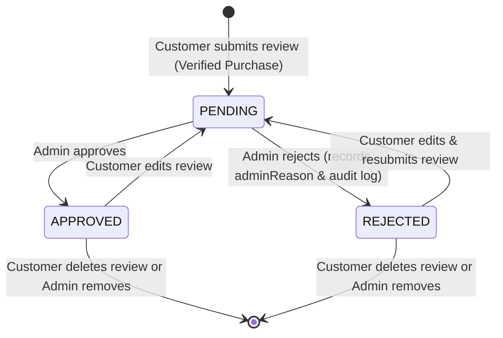

# Reviews Module Architecture & Documentation

The **Reviews Module** provides verified customer feedback, rating aggregations, customer ownership isolation, and administrative moderation for the E-Commerce platform.

---

## 1. Core Architectural Principles

1. **Verified Purchase Is the Source of Eligibility**:
   - A customer cannot create a review merely by supplying a `productId`.
   - The backend strictly verifies that the user owns an `OrderItem` belonging to that product within an order in state `DELIVERED` or `COMPLETED`.
   - Client claims (e.g. `{ "verifiedPurchase": true }`) are ignored.

2. **Single Active Review Invariant**:
   - A database unique constraint on `(userId, productId)` prevents duplicate reviews and rating inflation.
   - If a customer makes repeat purchases of the same product, they continue to own their single canonical review and can update it.
   - If a review is `REJECTED`, the record is preserved and can be edited/resubmitted by the customer.

3. **Immutable Order Records**:
   - Reviews reference `orderItemId` for traceability without modifying historical `OrderItem` or `Order` snapshots.

4. **Moderation Lifecycle & Auditability**:
   - All newly created reviews begin in state `PENDING`.
   - Admin moderation decisions record `status` (`APPROVED` or `REJECTED`), `adminReason`, `moderatedByUserId`, and `moderatedAt`.
   - If a customer edits an `APPROVED` or `REJECTED` review, its status automatically returns to `PENDING` to trigger administrative re-moderation before public visibility is restored.

5. **Approved-Only Public Aggregations**:
   - Public product queries and rating summaries only include `APPROVED` reviews.
   - Average ratings and star distributions are computed via high-performance SQL aggregation queries rather than calculating ratings in Node.js memory.

---

## 2. Review Lifecycle State Machine



---

## 3. Database Schema

### Table: `reviews`

| Column | Type | Constraints | Description |
| :--- | :--- | :--- | :--- |
| `id` | `UUID` | Primary Key, Default `uuid_generate_v4()` | Unique review identifier |
| `userId` | `UUID` | Foreign Key &rarr; `users.id` (ON DELETE RESTRICT) | Author customer |
| `productId` | `UUID` | Foreign Key &rarr; `products.id` (ON DELETE CASCADE) | Target product |
| `orderItemId` | `UUID` | Foreign Key &rarr; `order_items.id` (ON DELETE RESTRICT) | Qualifying order line item |
| `rating` | `INTEGER` | Check `rating >= 1 AND rating <= 5` | Star rating (1 to 5) |
| `title` | `VARCHAR(150)` | Nullable | Optional headline |
| `content` | `TEXT` | NOT NULL | Detailed written feedback |
| `status` | `reviews_status_enum` | NOT NULL, Default `'PENDING'` | `PENDING`, `APPROVED`, `REJECTED` |
| `adminReason` | `TEXT` | Nullable | Moderator feedback / rejection reason |
| `moderatedByUserId`| `UUID` | Nullable | Administrator who moderated |
| `moderatedAt` | `TIMESTAMP` | Nullable | Moderation timestamp |
| `createdAt` | `TIMESTAMP` | NOT NULL, Default `now()` | Timestamp of creation |
| `updatedAt` | `TIMESTAMP` | NOT NULL, Default `now()` | Timestamp of last update |

### Constraints & Indexes
- `UQ_reviews_user_product`: `UNIQUE ("userId", "productId")`
- `IDX_reviews_product_status`: `INDEX ("productId", "status")`
- `IDX_reviews_status`: `INDEX ("status")`
- `IDX_reviews_created_at`: `INDEX ("createdAt")`

---

## 4. API Endpoints Reference

### Customer & Catalog Routes

| Method | Endpoint | Access | Description |
| :--- | :--- | :--- | :--- |
| `POST` | `/api/v1/catalog/products/:productId/reviews` | Customer (`JwtAuthGuard`) | Submit review for a verified purchase |
| `GET` | `/api/v1/catalog/products/:productId/reviews` | Public (`@Public()`) | List approved reviews + rating summary |
| `GET` | `/api/v1/reviews/me` | Customer (`JwtAuthGuard`) | List all reviews written by current customer |
| `GET` | `/api/v1/reviews/:id` | Public / Customer / Admin | Get review details by UUID |
| `PATCH` | `/api/v1/reviews/:id` | Customer (`JwtAuthGuard`) | Update own review (resets status to `PENDING`) |
| `DELETE` | `/api/v1/reviews/:id` | Customer (`JwtAuthGuard`) | Delete own review |

### Admin Moderation Routes

| Method | Endpoint | Access | Description |
| :--- | :--- | :--- | :--- |
| `GET` | `/api/v1/admin/reviews` | Admin (`RolesGuard` - `ADMIN`) | List platform reviews with status filter |
| `GET` | `/api/v1/admin/reviews/:id` | Admin (`RolesGuard` - `ADMIN`) | Get review details with audit metadata |
| `PATCH` | `/api/v1/admin/reviews/:id/moderation` | Admin (`RolesGuard` - `ADMIN`) | Approve or reject review |
| `DELETE` | `/api/v1/admin/reviews/:id` | Admin (`RolesGuard` - `ADMIN`) | Delete review by administrator |

---

## 5. Example Requests & Responses

### 1. Submit Review (Verified Purchase)
```http
POST /api/v1/catalog/products/e5f6a7b8-9012-34cd-ef56-789012345678/reviews
Authorization: Bearer <CUSTOMER_JWT>
Content-Type: application/json

{
  "rating": 5,
  "title": "Exceptional comfort and style",
  "content": "These shoes exceeded my expectations. Very comfortable for daily workouts and running."
}
```

**Response (`201 Created`):**
```json
{
  "id": "f7a8b9c0-1234-5678-90ab-cdef12345678",
  "productId": "e5f6a7b8-9012-34cd-ef56-789012345678",
  "rating": 5,
  "title": "Exceptional comfort and style",
  "content": "These shoes exceeded my expectations. Very comfortable for daily workouts and running.",
  "status": "PENDING",
  "isVerifiedPurchase": true,
  "author": {
    "id": "a1b2c3d4-e5f6-7890-abcd-ef1234567890",
    "fullName": "Jane Doe"
  },
  "createdAt": "2026-02-19T10:00:00.000Z",
  "updatedAt": "2026-02-19T10:00:00.000Z"
}
```

---

### 2. Admin Moderation
```http
PATCH /api/v1/admin/reviews/f7a8b9c0-1234-5678-90ab-cdef12345678/moderation
Authorization: Bearer <ADMIN_JWT>
Content-Type: application/json

{
  "status": "APPROVED",
  "reason": "Verified purchase review with authentic user feedback."
}
```

**Response (`200 OK`):**
```json
{
  "id": "f7a8b9c0-1234-5678-90ab-cdef12345678",
  "productId": "e5f6a7b8-9012-34cd-ef56-789012345678",
  "orderItemId": "d4e5f6a7-b890-12cd-ef34-567890123456",
  "rating": 5,
  "title": "Exceptional comfort and style",
  "content": "These shoes exceeded my expectations. Very comfortable for daily workouts and running.",
  "status": "APPROVED",
  "adminReason": "Verified purchase review with authentic user feedback.",
  "moderatedByUserId": "9a8b7c6d-5e4f-3a2b-1c0d-ef9876543210",
  "moderatedAt": "2026-02-19T10:15:00.000Z",
  "user": {
    "id": "a1b2c3d4-e5f6-7890-abcd-ef1234567890",
    "fullName": "Jane Doe",
    "email": "jane.doe@example.com"
  },
  "createdAt": "2026-02-19T10:00:00.000Z",
  "updatedAt": "2026-02-19T10:15:00.000Z"
}
```

---

### 3. Public Product Reviews & Rating Aggregation
```http
GET /api/v1/catalog/products/e5f6a7b8-9012-34cd-ef56-789012345678/reviews?page=1&limit=10&sortBy=createdAt&sortOrder=DESC
```

**Response (`200 OK`):**
```json
{
  "items": [
    {
      "id": "f7a8b9c0-1234-5678-90ab-cdef12345678",
      "productId": "e5f6a7b8-9012-34cd-ef56-789012345678",
      "rating": 5,
      "title": "Exceptional comfort and style",
      "content": "These shoes exceeded my expectations. Very comfortable for daily workouts and running.",
      "status": "APPROVED",
      "isVerifiedPurchase": true,
      "author": {
        "id": "a1b2c3d4-e5f6-7890-abcd-ef1234567890",
        "fullName": "Jane Doe"
      },
      "createdAt": "2026-02-19T10:00:00.000Z",
      "updatedAt": "2026-02-19T10:15:00.000Z"
    }
  ],
  "meta": {
    "page": 1,
    "limit": 10,
    "totalItems": 1,
    "totalPages": 1
  },
  "ratingSummary": {
    "averageRating": 5.0,
    "reviewCount": 1,
    "ratingDistribution": {
      "5": 1,
      "4": 0,
      "3": 0,
      "2": 0,
      "1": 0
    }
  }
}
```

---

## 6. Error Conditions Reference

| HTTP Code | Error Response | Cause |
| :--- | :--- | :--- |
| `401 Unauthorized` | Missing or expired Bearer JWT | Caller did not supply a valid JWT access token |
| `403 Forbidden` | `Verified purchase required...` | Customer does not have a `DELIVERED` or `COMPLETED` order containing this product |
| `403 Forbidden` | `You are not authorized to modify this review` | Customer attempting to update or delete another customer's review |
| `404 Not Found` | `Product with ID '...' not found` | Targeted product does not exist |
| `404 Not Found` | `Review with ID '...' not found` | Review does not exist, or is non-approved when requested by public caller |
| `409 Conflict` | `You have already reviewed this product...` | Customer already has an existing review record for this product |
